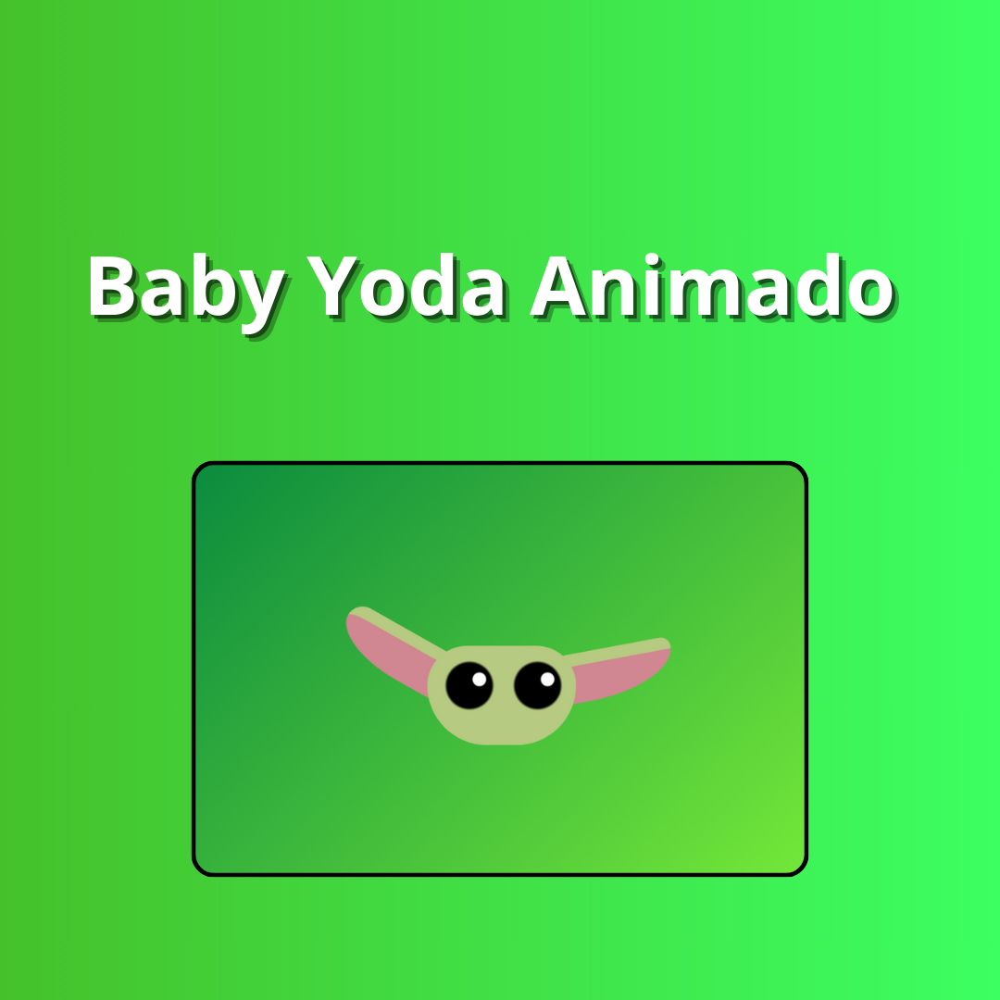

<h1 align="center"> Projeto Baby Yoda</h1>

"Baby Yoda" é o apelido carinhoso dado pelos fãs ao personagem Grogu, que aparece na série The Mandalorian, parte do universo de Star Wars. Ele pertence à mesma espécie do famoso Mestre Yoda, mas não é o próprio Yoda em sua juventude, como muitos pensavam inicialmente.

  <a href="#-tecnologias">Tecnologias</a>&nbsp;&nbsp;&nbsp;|&nbsp;&nbsp;&nbsp;
  <a href="#-projeto">Projeto</a>&nbsp;&nbsp;&nbsp;|&nbsp;&nbsp;&nbsp;
  <a href="#-layout">Layout</a>&nbsp;&nbsp;&nbsp;|&nbsp;&nbsp;&nbsp;
  <a href="#memo-licença">Licença</a>

  

 

  

## 🚀 Tecnologias

Esse projeto foi desenvolvido com as seguintes tecnologias:

- HTML
- CSS

## 💻 Projeto

Esse projeto é o Baby Yoda do filme Star Wars. Nesse projeto o as orelinhas do baby yoda ficam mexendo. Utilizei @keyframes e animation{} para concluir o projeto. 

## 🎓 Aprendizado

Esse foi um projeto utilizando HTML e CSS. Foi bem desafiador e nele eu consegui utilizar alguns conceitos bem novos e que foram bem difícieis no início como o @keyframes e o animation {}

## :memo: Licença

Esse projeto está sob a licença MIT.

---